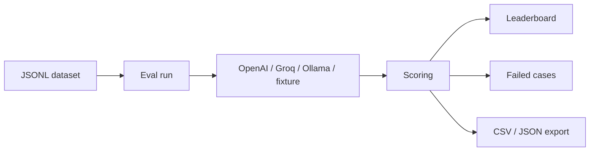

# Evalkit

**LLM evaluation studio** — upload a JSONL dataset, run 1–3 models (OpenAI, Groq, or Ollama), score every answer, and compare a leaderboard.

This is an evaluation harness, not a chatbot. Scoring, cost, latency, and failure cases are first-class.

[](https://github.com/MIANSAQLAIN237/evalkit/actions/workflows/ci.yml)


## Demo (works without API keys)

```
http://localhost:3000
email:    demo@evalkit.dev
password: demo1234
```

Or click **Launch live demo** on the home page. A 30-item mix of math, coding, RAG, and reasoning is already scored so recruiters can click around immediately.

If `OPENAI_API_KEY` / `GROQ_API_KEY` / Ollama are not set, Evalkit still runs using **deterministic fixtures**. The UI labels those rows `fixture` instead of `live`.

---

## What the product does

1. You create an **eval project**.
2. You upload a **JSONL dataset**: each line is one question + the expected answer + optional tags.
3. You pick **1–3 models** and click **Run eval**.
4. Evalkit calls each model (or a fixture fallback), then scores:
   - exact match
   - contains
   - judge score 1–5
5. You get a **leaderboard** (accuracy, judge, cost, speed), **side-by-side failures**, tag filters, and **CSV / JSON export**.



---

## Input

### Dataset file (JSONL)

One JSON object per line. Blank lines are skipped. Invalid lines are reported with a line number; valid rows are still imported.

**Required fields** (aliases accepted):

| Field | Aliases | Meaning |
|---|---|---|
| `prompt` | `input` | Question sent to the model |
| `expected` | `output`, `answer` | Gold answer used for scoring |
| `tags` | string or string[] | Optional labels such as `math`, `coding`, `rag` |

**Example** — also in [`public/sample-eval.jsonl`](public/sample-eval.jsonl):

```json
{"prompt":"What is 17 × 24?","expected":"408","tags":["math"]}
{"input":"HTTP created status","output":"201","tags":"coding"}
```

**Limits**

| Limit | Value |
|---|---|
| Rows per upload | 500 |
| Rows per run | 200 |
| Prompt length | 20,000 characters |
| Expected length | 8,000 characters |
| File / paste size | 1.5 MB |
| Tags per row | 8 |

### Run configuration (UI)

| Input | What it does |
|---|---|
| Dataset | Which JSONL set to score |
| Models (1–3) | OpenAI GPT-4o mini / GPT-4.1 mini, Groq Llama 3.1 8B / 3.3 70B, Ollama Llama 3.2 / Mistral |
| Judge toggle | 1–5 grader (live LLM if a key exists, otherwise heuristic) |
| Temperature | Fixed at `0` for reproducible evals |
| Max tokens | `512` by default |

### Environment variables

Copy [`.env.example`](.env.example) to `.env`.

| Variable | Required | Purpose |
|---|---|---|
| `DATABASE_URL` | yes | PostgreSQL connection string |
| `SESSION_SECRET` | yes | ≥ 32 characters, signs the login cookie |
| `DEMO_LOGIN` | no | `true` enables one-click demo login |
| `OPENAI_API_KEY` | no | Live OpenAI completions + optional LLM judge |
| `GROQ_API_KEY` | no | Live Groq completions |
| `OLLAMA_BASE_URL` | no | Default `http://127.0.0.1:11434` |

Never commit `.env`. API keys stay on the server.

---

## Output

### Leaderboard (UI)

One row per model:

| Column | Meaning |
|---|---|
| Exact | `%` of rows where normalized output == expected |
| Contains | `%` of rows where expected is a substring of output |
| Judge | Average 1–5 score |
| Latency | Average time per item |
| Cost | Estimated USD from token usage |
| Source | `live`, `fixture`, or `mixed` |

### Failed cases (UI)

For each miss: prompt, **expected** vs **model output**, tags, exact/contains badges, judge reason. Filter by tag (`math`, `coding`, `rag`, `reasoning`, …).

### CSV export

`GET /api/runs/:id/export?format=csv`

```text
model,prompt,expected,output,tags,exact_match,contains_match,judge_score,judge_reason,latency_ms,cost_usd,error
openai/gpt-4o-mini,What is 17 × 24?,408,408,math,true,true,5,Exact match after normalization.,49,0.000001,
```

### JSON export

`GET /api/runs/:id/export?format=json`

```json
{
  "run": {
    "id": "run_...",
    "status": "COMPLETED",
    "judgeMode": "heuristic",
    "dataset": "core-30",
    "models": [{ "provider": "openai", "modelId": "gpt-4o-mini", "exactAccuracy": 0.8 }]
  },
  "results": [
    {
      "model": "openai/gpt-4o-mini",
      "prompt": "What is 17 × 24?",
      "expected": "408",
      "output": "408",
      "tags": ["math"],
      "exactMatch": true,
      "containsMatch": true,
      "judgeScore": 5,
      "latencyMs": 49,
      "costUsd": 0.000001
    }
  ]
}
```

`exactAccuracy` is a fraction (`0.8` = 80%).

---

## How scoring works

| Metric | Rule |
|---|---|
| **Exact match** | Trim, lowercase, collapse whitespace, then `==` |
| **Contains** | Normalized expected string appears in the output |
| **Judge 5** | Exact match |
| **Judge 4** | Expected is contained in the output |
| **Judge 3 / 2 / 1** | Token F1 overlap (high / partial / low), or empty output = 1 |

If an OpenAI or Groq key is present, the judge asks a model for `{"score":n,"reason":"..."}`. If that call fails, Evalkit falls back to the heuristic and records `judgeMode: heuristic`.

Every run stores **model id, temperature, max tokens, and judge mode** so two runs can be compared.

---

## How a run executes

```text
Browser  →  Next.js App Router
              ├─ Pages: dashboard, project, run results
              ├─ APIs: auth, dataset import, eval SSE, export
              └─ Prisma → PostgreSQL

Providers: OpenAI  |  Groq  |  Ollama  |  fixture fallback
```

- Concurrency **3** item calls at a time
- **25s** timeout per item
- Progress streamed as SSE (`start` → `item` → `done`)
- Provider errors fall back to fixtures instead of crashing the whole run

---

## Local setup

Needs **Node 20+** and **Docker** (Postgres).

```bash
git clone https://github.com/MIANSAQLAIN237/evalkit.git
cd evalkit
cp .env.example .env
# set SESSION_SECRET to a long random string, e.g. openssl rand -hex 32

npm install
npm run db:up
npx prisma migrate dev
npm run db:seed
npm run dev
```

Open [http://localhost:3000](http://localhost:3000).

Postgres is mapped to **localhost:5433** so it does not clash with a local Postgres on 5432.

### Useful commands

| Command | What it does |
|---|---|
| `npm run dev` | Next.js (Turbopack) |
| `npm test` | Scoring + JSONL unit tests |
| `npm run typecheck` | `tsc --noEmit` |
| `npm run lint` | ESLint |
| `npm run db:up` | Start Postgres |
| `npm run db:seed` | Demo user + completed 3-model run |
| `npm run db:reset` | Wipe DB and re-seed |

---

## App routes

| URL | What you see |
|---|---|
| `/` | Product landing + launch demo |
| `/login` `/signup` | Auth |
| `/dashboard` | Your projects |
| `/projects/:id` | Datasets, past runs, JSONL import |
| `/projects/:id/run` | Pick models and start an eval |
| `/projects/:id/runs/:runId` | Leaderboard, failures, export |

### API (cookie session)

| Method | Path | Input | Output |
|---|---|---|---|
| `POST` | `/api/auth/signup` | `{ name, email, password }` | user + session cookie |
| `POST` | `/api/auth/login` | `{ email, password }` | user + session cookie |
| `POST` | `/api/auth/demo` | — | signs in `demo@evalkit.dev` |
| `POST` | `/api/auth/logout` | — | clears cookie |
| `GET/POST` | `/api/projects` | `{ name, description }` | project list / created project |
| `POST` | `/api/projects/:id/datasets` | `{ name, jsonl }` | imported count + parse errors |
| `POST` | `/api/projects/:id/runs` | `{ datasetId, models[1-3], judgeEnabled }` | SSE progress, then a run id |
| `GET` | `/api/runs/:id/export?format=csv\|json` | — | file download |
| `GET` | `/api/health` | — | `{ ok, providers }` |

Errors are always:

```json
{ "error": { "code": "VALIDATION", "message": "..." } }
```

---

## Folder structure

```text
evalkit/
  prisma/schema.prisma      # Postgres models
  prisma/seed.ts            # demo user + 30-item completed run
  public/sample-eval.jsonl  # tiny file you can upload
  src/app/                  # Next.js pages + route handlers
  src/components/           # UI
  src/lib/scoring.ts        # exact / contains / judge (tested)
  src/lib/jsonl.ts          # parser (tested)
  src/lib/eval/runner.ts    # run loop
  src/lib/providers/        # OpenAI-compatible + fixture
  docker-compose.yml        # Postgres 16
  .env.example
```

---

## Security

- Passwords hashed with bcrypt (12 rounds)
- Session JWT in an **httpOnly** cookie, SameSite=Lax, `secure` in production
- Auth routes are rate-limited
- Zod validation on every mutation
- Upload size and prompt length are capped
- Provider keys never go to the browser

---

## Deploy

1. Postgres: Neon, RDS, or any Postgres 16
2. App: Vercel (or any Node host)
3. Set `DATABASE_URL` and `SESSION_SECRET`
4. `npx prisma migrate deploy`
5. Optional: add provider keys

Keep public demo datasets small (≤ 30 items). Long runs can hit serverless timeouts.

---

## Stack

Next.js 16 · React 19 · TypeScript · PostgreSQL · Prisma · Zod · Vitest · Docker
